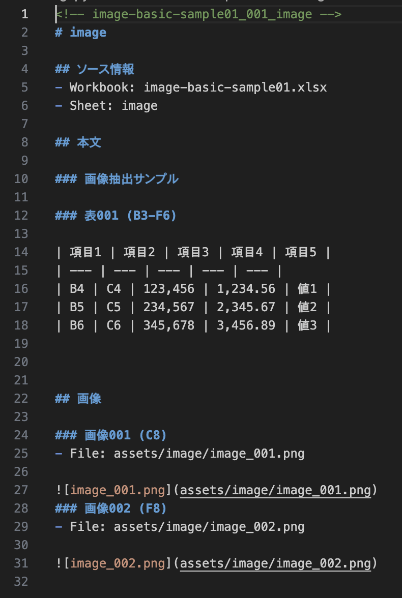
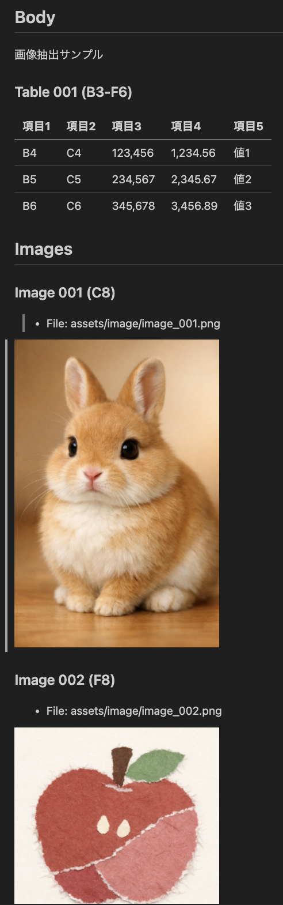

# xlsx2md

## What is this?

`xlsx2md` is a single-file web app that reads Excel (`.xlsx`) files locally and extracts prose, tables, and images as Markdown.

- Runs entirely in the browser with no server communication
- Converts the whole workbook automatically without sheet-by-sheet manual work
- Makes workbook content easier to reuse in generative AI workflows

## Features

- Reads `.xlsx` files directly in the browser and processes them locally
- Converts all sheets in a workbook in one pass
- Extracts prose, tables, and images
- Preserves supported Excel rich text in `github` formatting mode
- Preserves external links and workbook-internal links as Markdown links when supported
- Detects tables and converts them into Markdown tables
- Prefers cached formula values and parses formulas when needed
- Extracts chart configuration data
- Extracts shape source data as text and outputs SVG when supported
- Saves output as Markdown or ZIP

## Use Cases

- Convert Excel workbooks into Markdown for generative AI input
- Extract prose, tables, and images into a reusable text-based format
- Process an entire workbook without manual work on each sheet
- Handle sensitive files locally without uploading them to a server
- Use the tool in a browser without installing additional applications

## How to use

1. Open `xlsx2md.html` in a web browser
2. Select an `.xlsx` file
3. After loading, Markdown for all sheets is generated automatically
4. Save the result as Markdown or ZIP

### Node CLI

You can also run the conversion in batch mode from Node.js.
The CLI intentionally stays small in the Unix style: one input workbook at a time, with Markdown or ZIP written to a file.
CLI interface may change.

Options:

- `--out <file>`: Write combined Markdown to a file
- `--zip <file>`: Write ZIP export to a file
- `--output-mode <mode>`: `display`, `raw`, or `both`
- `--formatting-mode <mode>`: `plain` or `github`
- `--table-detection-mode <mode>`: `balanced` or `border`
- `--shape-details <mode>`: `include` or `exclude`
- `--include-shape-details`: Alias for `--shape-details include`
- `--no-header-row`: Do not treat the first row as a table header
- `--no-trim-text`: Preserve surrounding whitespace
- `--keep-empty-rows`: Keep empty rows
- `--keep-empty-columns`: Keep empty columns
- `--summary`: Print per-sheet summary to stdout
- `--help`: Show help and exit

Exit codes:

- `0`: Success
- `1`: Error

```bash
npm run cli -- ./tests/fixtures/xlsx2md-basic-sample01.xlsx --out /tmp/xlsx2md-basic.md
```

ZIP export is also available.

```bash
npm run cli -- ./tests/fixtures/xlsx2md-basic-sample01.xlsx --zip /tmp/xlsx2md-basic.zip
```

ZIP entry timestamps are intentionally fixed to `2025-01-01 00:00:00`. This keeps ZIP output reproducible across runs instead of embedding the current time and changing the archive bytes every time.

You can also switch the Markdown output mode or include shape source details.

```bash
npm run cli -- ./tests/fixtures/shape/shape-basic-sample01.xlsx --output-mode both --shape-details include
```

You can also switch how Excel text emphasis is rendered. `github` formatting mode currently preserves supported `bold`, `italic`, `strike`, `underline`, and in-cell line breaks as `<br>`. Hyperlinks are emitted as Markdown links, and hyperlink cells suppress extra underline markup in output.

```bash
npm run cli -- ./tests/fixtures/rich/rich-text-github-sample01.xlsx --formatting-mode github
```

You can also switch table detection behavior. `balanced` keeps the existing heuristic, while `border` detects tables from bordered regions and suppresses borderless fallback detection.

```bash
npm run cli -- ./tests/fixtures/table/table-border-priority-sample01.xlsx --table-detection-mode border
```

## Tech Stack

- Runtime: Web Browser
- App: HTML, CSS, and JavaScript
- Source language: TypeScript
- Build tooling: Node.js and esbuild
- Testing: Vitest and jsdom
- UI dependency: `@material/web`

`index.html` and `xlsx2md.html` are generated files. Edit `index-src.html` and `xlsx2md-src.html` instead.

## How it works

- Read `.xlsx` files in the browser
- Open the file contents and read internal data
- Analyze sheet, image, and related workbook information
- Prefer cached formula values and parse formulas when needed
- Extract prose, tables, and images
- Detect tables and convert them into Markdown tables
- Extract chart configuration information only
- Extract shape source data as text, and output SVG when supported
- Assemble the workbook into Markdown output

For more details, see:

- High-level specification and design policy: [docs/xlsx2md-spec.md](./docs/xlsx2md-spec.md)
- Detailed implementation-oriented specification: [docs/xlsx2md-impl-spec.md](./docs/xlsx2md-impl-spec.md)

## Example

This is the main `xlsx2md` screen where you load an Excel workbook and review the generated result.


The input workbook can contain prose, tables, images, and other spreadsheet content spread across multiple sheets.


After loading the workbook, `xlsx2md` extracts the content and generates Markdown text automatically.



The generated Markdown can then be previewed as a readable document.



## License

### xlsx2md

- Released under the Apache License 2.0
- See [LICENSE](./LICENSE) for the full license text
- Third-party software and reference notices are listed in [THIRD_PARTY_NOTICES.md](./THIRD_PARTY_NOTICES.md)

--------------------------------------------------------------------------------

## What is this?

`xlsx2md` は、Excel (`.xlsx`) をローカルで読み込み、地の文・表・画像を Markdown として抽出する Single-file Web App です。

- ブラウザ内でローカルに動作し、サーバ通信を行いません
- Excel ブック全体を、シートごとの手作業なしで自動変換します
- 生成AI に渡しやすい Markdown 形式で情報を取り出せます

## Features

- `.xlsx` ファイルをブラウザ内で読み込み、ローカル環境だけで処理
- 全シートをまとめて一括変換
- 地の文・表・画像を抽出
- `github` formatting mode では、対応する Excel の rich text を Markdown / HTML へ反映
- 表を検知して Markdown の表へ変換
- 数式は保存済みの値を優先し、必要に応じて数式も解析
- グラフは設定情報を抽出
- 図形は元データをテキストとして抽出し、対応できるものは SVG も出力
- Markdown または ZIP として保存可能

## Use Cases

- Excel ブックの内容を、生成AI に渡しやすい Markdown に変換したい
- 地の文・表・画像をまとめて抽出し、再利用しやすい形にしたい
- シートごとの手作業なしで、ブック全体を一括処理したい
- サーバにアップロードせず、ローカル環境だけで安全に処理したい
- Webブラウザだけで動かし、追加アプリをインストールせずに使いたい

## How to use

1. Webブラウザで `xlsx2md.html` を開く
2. `.xlsx` ファイルを選択する
3. 読み込み後、自動で全シートの Markdown が生成される
4. Markdown または ZIP を保存する

### Node CLI

Node.js からバッチ実行することもできます。
CLI は UNIX 的に小さく保つ方針で、基本は 1 回につき 1 つのワークブックを受け取り、Markdown または ZIP をファイルへ出力します。
CLI interface may change.

オプション一覧:

- `--out <file>`: 結合済み Markdown をファイルへ出力
- `--zip <file>`: ZIP をファイルへ出力
- `--output-mode <mode>`: `display` / `raw` / `both`
- `--formatting-mode <mode>`: `plain` / `github`
- `--table-detection-mode <mode>`: `balanced` / `border`
- `--shape-details <mode>`: `include` / `exclude`
- `--include-shape-details`: `--shape-details include` の互換 alias
- `--no-header-row`: 先頭行を表ヘッダーとして扱わない
- `--no-trim-text`: 前後の空白を維持する
- `--keep-empty-rows`: 空行を維持する
- `--keep-empty-columns`: 空列を維持する
- `--summary`: シートごとのサマリーを標準出力に表示
- `--help`: ヘルプを表示して終了

終了コード:

- `0`: 成功
- `1`: エラー

```bash
npm run cli -- ./tests/fixtures/xlsx2md-basic-sample01.xlsx --out /tmp/xlsx2md-basic.md
```

ZIP 出力にも対応しています。

```bash
npm run cli -- ./tests/fixtures/xlsx2md-basic-sample01.xlsx --zip /tmp/xlsx2md-basic.zip
```

ZIP 内 entry の timestamp は、意図的に `2025-01-01 00:00:00` へ固定しています。毎回の現在時刻を埋め込むと、内容が同じでも ZIP バイナリが毎回変わってしまうため、再現性を優先しています。

Markdown の出力モードを切り替えたり、図形の source details を含めたりすることもできます。

```bash
npm run cli -- ./tests/fixtures/shape/shape-basic-sample01.xlsx --output-mode both --shape-details include
```

Excel の文字装飾の出し方も切り替えられます。`github` formatting mode は、現時点で `bold`、`italic`、`strike`、`underline`、セル内改行の `<br>` に対応します。

```bash
npm run cli -- ./tests/fixtures/rich/rich-text-github-sample01.xlsx --formatting-mode github
```

表検出の挙動も切り替えられます。`balanced` は既定のヒューリスティックを維持し、`border` は罫線のある領域からだけ表を検出し、borderless fallback 検知を抑えます。

```bash
npm run cli -- ./tests/fixtures/table/table-border-priority-sample01.xlsx --table-detection-mode border
```

補足:

- `plain` は装飾を落として素朴なテキストへ寄せるモードです
- `github` は GitHub 上の見え方を優先して Markdown / HTML を使うモードです
- `balanced` は従来どおりの表検出モードです
- `border` は非罫線ベースの誤検知が辛いシート向けの表検出モードです
- 内部的には `markdown escape -> rich text parser -> plain/github formatter -> table escape` の段階分離を進めています
- Markdown 記号を含む生文字の escape は段階的に整理中です。現状の設計メモは [docs/rich-text-markdown-rendering.md](./docs/rich-text-markdown-rendering.md) を参照してください

## Tech Stack

- 実行環境: Web Browser
- アプリ: HTML / CSS / JavaScript
- ソース言語: TypeScript
- ビルドツール: Node.js / esbuild
- テスト: Vitest / jsdom
- UI 依存: `@material/web`

`index.html` と `xlsx2md.html` は生成物です。編集は `index-src.html` と `xlsx2md-src.html` に対して行ってください。

## How it works

- Webブラウザ内で `.xlsx` ファイルを読み込む
- ファイルの中身を展開して内部データを読み取る
- シート、画像、関連するブック情報を解析する
- 数式は保存済みの値を優先し、必要に応じて数式を解析する
- 地の文、表、画像を抽出する
- 表を検知して Markdown の表へ変換する
- グラフは設定情報のみを抽出する
- 図形は元データをテキストとして抽出し、対応できるものは SVG も出力する
- ブック全体を Markdown 出力としてまとめる

詳細は以下の文書を参照してください。

- 上位仕様と設計方針: [docs/xlsx2md-spec.md](./docs/xlsx2md-spec.md)
- 現行実装に即した詳細仕様: [docs/xlsx2md-impl-spec.md](./docs/xlsx2md-impl-spec.md)

## Example

これは `xlsx2md` のメイン画面です。ここで Excel ブックを読み込み、生成された結果を確認します。


入力となる Excel ブックには、地の文、表、画像などの情報が複数シートにまたがって含まれます。


ブックを読み込むと、`xlsx2md` が内容を抽出し、Markdown テキストを自動生成します。


生成された Markdown は、文書として読みやすい形でプレビューできます。


## License

### xlsx2md

- Apache License 2.0 のもとで公開しています
- ライセンス本文は [LICENSE](./LICENSE) を参照してください
- 第三者ソフトウェアおよび参考資料に関する記載は [THIRD_PARTY_NOTICES.md](./THIRD_PARTY_NOTICES.md) を参照してください
